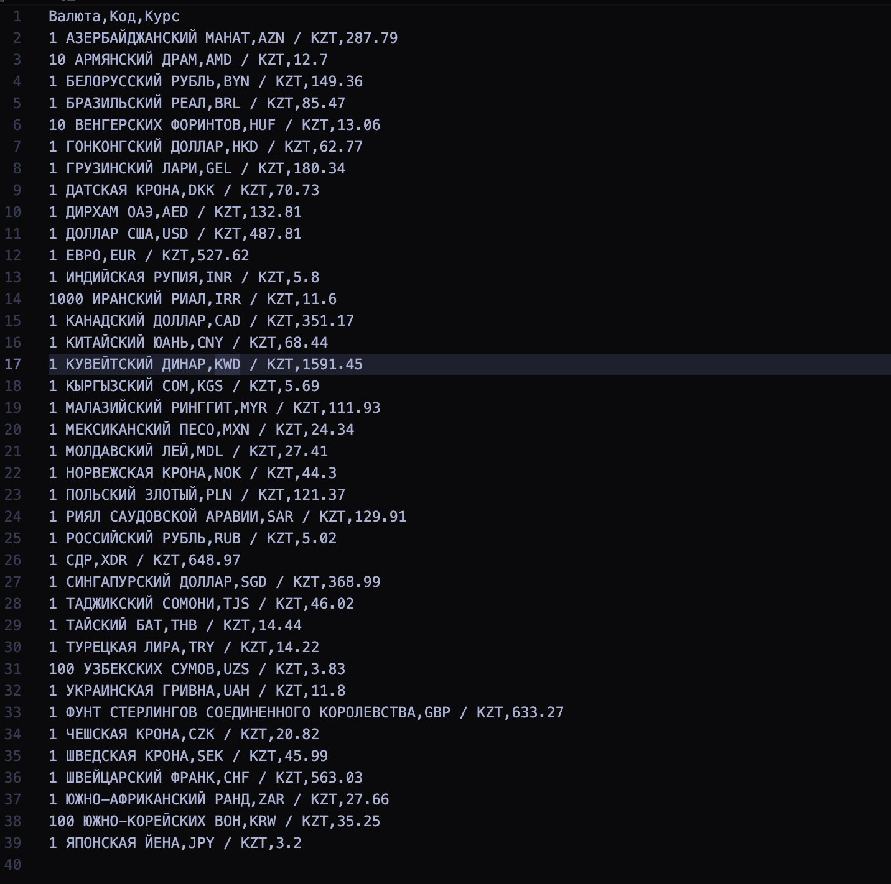

# сurrency сonversion

## Description

**Currency Conversion** is a Python application that retrieves and saves the latest foreign exchange rates from the official website of the National Bank of Kazakhstan. The script extracts data about various currencies, their codes, and current exchange rates, then saves this information into a CSV file for easy access and further processing.

## Features

- **Real-Time Exchange Rates:** Fetches up-to-date currency exchange rates from the official National Bank of Kazakhstan website.
- **CSV Export:** Saves the retrieved exchange rates into a `currency_rates.csv` file for convenient storage and analysis.
- **Error Handling:** Gracefully handles connection issues and parsing errors to ensure reliable operation.
- **Simple and Lightweight:** Easy to set up and use with minimal dependencies.

## Demo



### Installation Steps

1. **Clone the Repository:**

    ```bash
    git clone https://github.com/yerass11/currency_conversion.git
    ```

2. **Navigate to the Project Directory:**

    ```bash
    cd currency_conversion
    ```

3. **Create a Virtual Environment (Recommended):**

    ```bash
    python -m venv venv
    ```

4. **Activate the Virtual Environment:**

    - **Windows:**
        ```bash
        venv\Scripts\activate
        ```
    - **macOS and Linux:**
        ```bash
        source venv/bin/activate
        ```

### `Requirements`
  ```bash
  pip3 install requests
  pip3 install bs4 
  ```
1. **Run the Script to Fetch Exchange Rates:**

    ```bash
    python3 main.py
    ```

2. **Output:**

    After successfully running the script, a `currency_rates.csv` file will be created in the project directory containing the latest exchange rates.

### Example `currency_rates.csv` Content:

```csv
Валюта,Код,Курс
1 ДОЛЛАР США,USD / KZT,487.81
1 ЕВРО,EUR / KZT,527.62
...
```

## **Contributing**

### **Contributions are welcome! To contribute to this project, please follow these steps:**

#### Fork the Repository.
#### Create a New Branch for Your Feature:
```bash
git checkout -b feature/YourFeatureName
```
#### Make Your Changes and Commit Them:
```bash
git commit -m "add(feature) ..."
```
#### Push the Branch to GitHub:
```bash
git push origin feature/YourFeatureName
```
#### Open a Pull Request.

## **Contact**

If you have any questions or suggestions, feel free to reach out via erasylsaiman2005@gmail.com

### Libraries Used:
- [BeautifulSoup](https://www.crummy.com/software/BeautifulSoup/)
- [Requests](https://github.com/psf/requests.git)
